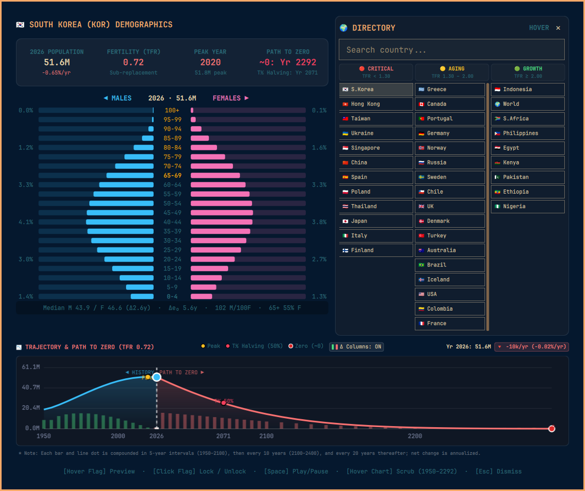

# Demographics & Population Decline (Omarchy Shell Plugin)

An interactive demographic analysis, population decline tracker, and vertical age-sex pyramid for Omarchy Linux.



## Features

- **3-Column Country Directory Grouped Strictly by TFR:**
  All 42 countries categorized into demographic severity columns:
  - **🔴 Ultra-Low TFR / Rapid Decline (< 1.30):** 🇰🇷 S.Korea, 🇭🇰 Hong Kong, 🇹🇼 Taiwan, 🇺🇦 Ukraine, 🇸🇬 Singapore, 🇨🇳 China, 🇪🇸 Spain, 🇵🇱 Poland, 🇹🇭 Thailand, 🇯🇵 Japan, 🇮🇹 Italy, 🇫🇮 Finland
  - **🟡 Aging & Sub-Replacement (1.30–2.00):** 🇬🇷 Greece, 🇨🇦 Canada, 🇵🇹 Portugal, 🇩🇪 Germany, 🇳🇴 Norway, 🇷🇺 Russia, 🇸🇪 Sweden, 🇨🇱 Chile, 🇬🇧 UK, 🇩🇰 Denmark, 🇹🇷 Turkey, 🇦🇺 Australia, 🇧🇷 Brazil, 🇮🇸 Iceland, 🇺🇸 USA, 🇨🇴 Colombia, 🇫🇷 France, 🇲🇽 Mexico, 🇦🇷 Argentina, 🇻🇳 Vietnam, 🇮🇳 India
  - **🟢 Growth & Expanding (≥ 2.00):** 🇮🇩 Indonesia, 🌍 World, 🇿🇦 S.Africa, 🇵🇭 Philippines, 🇪🇬 Egypt, 🇰🇪 Kenya, 🇵🇰 Pakistan, 🇪🇹 Ethiopia, 🇳🇬 Nigeria
- **Vertical Age-Sex Population Pyramid:** 21 age brackets (0–4 to 100+) with male (cyan) and female (rose) bilateral cohorts and hover tooltips.
- **Smooth 32-Frame Animation:** Pyramids are generated on the **same 5-year grid as the
  trajectory line chart** (1950–2100, plus the 2026 "now" anchor), so scrubbing the chart
  advances the pyramid one frame at a time instead of jumping between decades.
- **Gender & Age-Gap Metrics** per frame, shown under the pyramid: median age by sex and the
  gap between them, the life-expectancy gap, sex ratio (M per 100 F), and the female share of
  the 65+ population. Sex-ratio-at-birth distortion is modelled for the countries where it is
  documented (🇨🇳 🇮🇳 🇰🇷 🇹🇼 🇻🇳).
- **Continuous Trajectory Line Chart:**
  - **Sub-Replacement (TFR < 2.1):** Historical curve (1950–2026) followed by post-peak decline to **Zero / Extinction Horizon**.
  - **Above-Replacement (TFR ≥ 2.1):** Forward 100-year expansion trajectory to 2126.
  - Milestone markers for Peak Year, 2026 Current Year, Halving Year ($T_{1/2}$), and Zero Year ($\sim 0$).
- **Interactive Scrubber:** Scrub across the line chart to update demographic charts in real time.
- **Flag hover / lock:** Hover a country flag to preview its pyramid and trajectory. Click to lock that country; click the locked flag again to return to hover mode.

## Controls & Shortcuts

- **Click Bar Icon (`󰄹`):** Toggle dashboard.
- **Hover Flag:** Preview that country's pyramid, stats, and trajectory (does nothing while locked).
- **Click Flag:** Lock the hovered country so the dashboard stays on it. Click the locked flag again to unlock and return to hover-preview mode. Clicking a different flag while locked switches the lock to that country.
- **`Space`:** Play / Pause timeline animation.
- **`Left` / `Right` Arrow:** Step backward / forward one 5-year frame.
- **`Esc`:** Dismiss dashboard.
- **Right-Click Bar Icon:** Send desktop notification with quick demographic summary.

## Data & Method — please read

The per-country **anchors** in `scripts/build_data.py` (TFR, 2026 population, growth rate,
peak year and population, median age) are hand-entered approximations of published UN WPP
headline figures.

**Everything else is synthetic.** Every pyramid, every trajectory point and every life
expectancy is produced by the parametric models in that script — a cohort-component
projection (births from age-specific fertility, survival from a Gompertz–Makeham hazard with
sex-specific mortality). **This is not UN data and is not a projection.** It is built to look
plausible and to animate smoothly.

Modelling assumptions worth knowing:

- **TFR is held constant after 2026.** No recovery is assumed. UN medium-variant assumes
  convergence toward ~1.8, which would give noticeably less extreme pyramids than shown here.
- **Migration is ignored entirely.**
- Historical TFR level is *fitted* per country so the modelled 2026 median age matches its
  anchor — it is not sourced. 35 of 42 countries land within 1 year (mean deviation 0.37y).
  High-fertility countries run up to ~3.9y older than their anchor (worst: 🇰🇪 Kenya 20.5 →
  24.4); the model cannot reach a median age near 18 at the stated TFR, so pyramid shape for
  those countries is indicative only. Residuals are recorded in
  `metadata.calibration` in the generated JSON.

Regenerate with:

```bash
python3 scripts/build_data.py
```

## CLI & Shell IPC

```bash
# Toggle dashboard
omarchy-shell shell toggle bmg.population-pyramid
```
